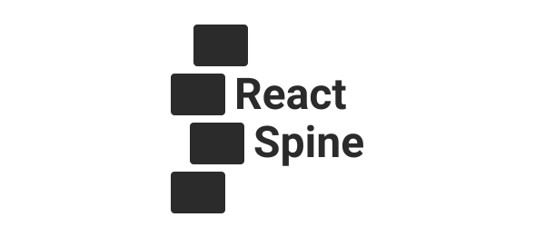

<p align="center">
  
</p>

**React Spine** is a simple responsive grid system for ReactJs made with flexbox and Styled Components. It works with simple or complex layouts.


[](https://www.npmjs.com/package/react-spine) [](https://standardjs.com)

## Install
This package can be installed via Yarn
```bash
yarn add react-spine
```
Or via NPM
```bash
npm i -s react-spine
```

## Usage

The grid system has two components: `Row` and `Col`, which represents the rows and the columns respectively. The row component defines the grid's basics, such as alignment and gutter, while the column component defines its width in each breakpoint. You can nest many grids inside each other.

Here's a simple example:

```jsx
import { Grid, Container } from 'react-spine'

const { Row, Col } = Grid

const App = () => (
  <Container>
    <Row justify={{md: 'flex-end'}}>
      <Col sm="12" md="1/4" lg="6">
        Column 1
      </Col>
      <Col sm="hide" md="1/4" lg="6">
        Column 2
      </Col>
      <Col sm={12} md="1/4" lg="6">
        Column 3
      </Col>
    </Row>
  </Container>
);

export default App
```

## Overriding default values
You can also override the default values by specifying your own Styled Components theme with a `spine` key.
```jsx
// Default values
const customTheme = {
  spine: {
    gridColumns: 12,
    gridGap: 10,
    breakpoints: {
      sm: 0,
      md: 768,
      lg: 1024
    }
  }
}

// And then
const App = () => (
  <ThemeProvider theme={customTheme}>
    your application here
  </ThemeProvider>
);
```

## API

### Row

| **Name**      | **Type** | **Default**                       | **Description**                                                                           |
| :------------ | :------- | :-------------------------------- | :---------------------------------------------------------------------------------------- |
| **gap** | String or Number | `0px` | Horizontal and vertical spacing between columns. |
| **gapX** | String or Number | `0px` | Horizontal spacing between columns. |
| **gapY** | String or Number | `0px` | Vertical spacing between columns. |
| **direction** | String or Object | `row` | The direction of the columns. It can be an object specifying the direction for each breakpoint: `{sm: 'row', md: 'column', lg: 'row'}`. |
| **justify**	  | String or Object | `row` | Align columns accordingly with direction. It can be an object specifying the alignment for each breakpoint: `{sm: 'flex-start', md: 'center', lg: 'flex-end'}`. |
| **align** 	  | String or Object | `stretch` | Align columns across main axis. It can be an object specifying the alignment for each breakpoint: `{sm: 'flex-start', md: 'center', lg: 'flex-end'}`. |
| **wrap** 		  | String or Object | `wrap` | Sets whether an item will be forced onto one line or can wrap into multiple lines. It can be an object specifying the wrap for each breakpoint: `{sm: 'nowrap', md: 'nowrap', lg: 'nowrap'}`. |
| **grow** 		  | String or Object | `0` | Specify if the remaining space can be assigned to the columns. It can be an object specifying the wrap for each breakpoint: `{sm: 0, md: 1, lg: 0}`. |
| **shrink** 	  | String or Object | `0` | Specify how much the columns can shrink relative to the rest of the columns. It can be an object specifying the wrap for each breakpoint: `{sm: 0, md: 1, lg: 0}`. |

### Col

| **Name**      | **Type** | **Description**                                                                           |
| :------------ | :------- | :---------------------------------------------------------------------------------------- |
| **span** | String or Number | The default size of all breakpoints. |
| **sm**   | String or Number | The size of the column for small screens. It can be a string representing a fraction or a integer representing a column span (12 columns total). |
| **md**	 | String or Number | The size of the column for medium screens. It can also be set to `hide` for not showing in that breakpoint. |
| **lg**	 | String or Number | The size of the column for large screens. |

## License

MIT © [jrmiranda](https://github.com/jrmiranda)
